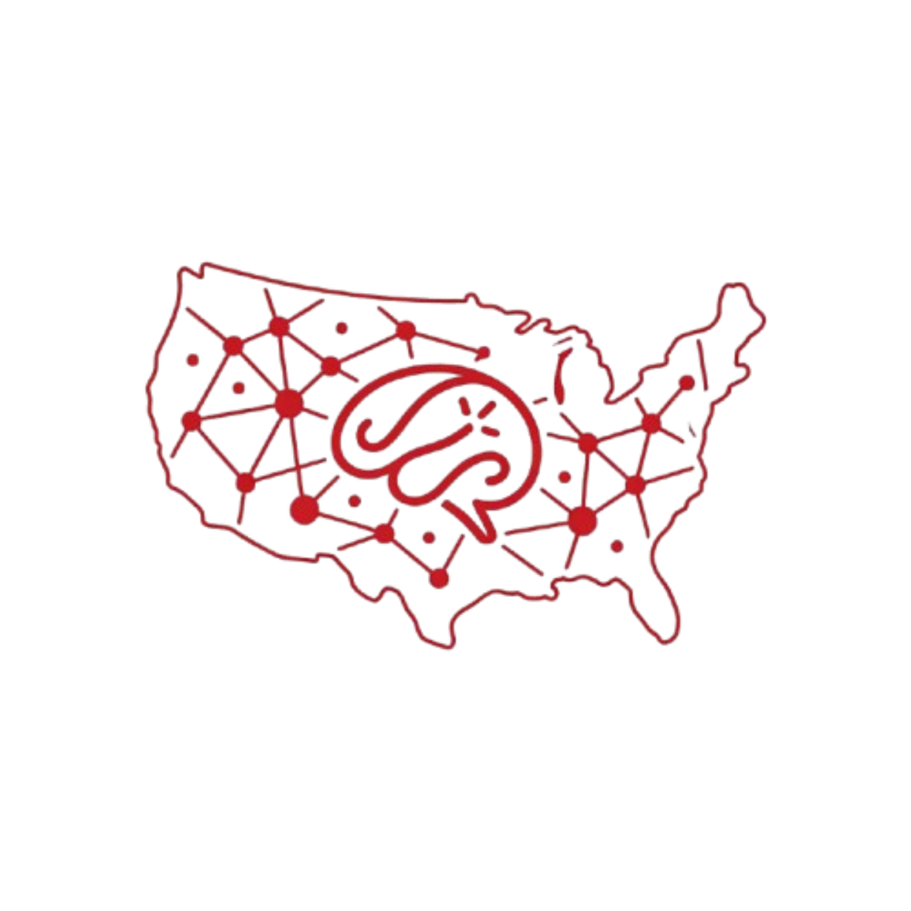

<div align="center">
  
  <h1>Digital Mindscapes</h1>
  <p><em>An Interactive Public Health &amp; Socioeconomic Data Visualization Platform</em></p>

  
  
  
  
  <br/><br/>

  <a href="https://digital-mindscapes.github.io"><strong>🌐 View Live Site »</strong></a>
</div>

---

## 📖 Overview

**Digital Mindscapes** is an academic data visualization platform exploring the intersection of public health, socioeconomic conditions, and community wellbeing across the United States. The platform provides interactive choropleth maps, customizable metric comparisons, county-level filtering, and exportable data tables to support research-driven storytelling.

Built as part of ongoing research at **Marquette University**, in collaboration with **UW-Milwaukee** and the **Medical College of Wisconsin (MCW)**.

<div align="center">
  
  &nbsp;&nbsp;&nbsp;
  
  &nbsp;&nbsp;&nbsp;
  
</div>

---

## 🗂️ Pages

| Page | Description |
|------|-------------|
| [`index.html`](index.html) | **State Explorer** — National choropleth map across 50+ health & socioeconomic metrics |
| [`comparison.html`](comparison.html) | **State Comparison** — Side-by-side bar chart comparison of selected U.S. states with table view |
| [`county_comparison.html`](county_comparison.html) | **County Comparison** — County-level map with multi-county selection, bar chart & table view grouped by state |
| [`multi_metric.html`](multi_metric.html) | **Multi-Metric View** — Explore multiple metrics simultaneously across states |
| [`urban_rural_comparison.html`](urban_rural_comparison.html) | **Urban-Rural Comparison** — County map filtered by RUCC Metro/Nonmetro classification |

---

## 📊 Data Sources

| Dataset | Source | Coverage |
|---------|--------|----------|
| **CDC PLACES** | [CDC PLACES 2023](https://www.cdc.gov/places/) | County-level health prevalence data |
| **American Community Survey (ACS)** | [U.S. Census Bureau](https://www.census.gov/programs-surveys/acs) | Socioeconomic indicators per county |
| **USDA RUCC Codes** | [USDA ERS](https://www.ers.usda.gov/data-products/rural-urban-continuum-codes/) | Rural-Urban Continuum Classification (2013) |

---

## 🚀 Features

- 🗺️ **Interactive Choropleth Maps** — powered by [amCharts 4 & 5](https://www.amcharts.com/), with zoom, pan, and tooltips
- 📊 **Dynamic Bar Charts** — select counties/states on the map and compare them instantly
- 📋 **Comparison Table View** — switch between chart and table views with heatmap coloring and mini bar distributions
- 🏙️ **Group by State** — in county table view, group selected counties under their full state name with flag icons
- 🏙️ **Urban-Rural Filter** — filter counties by Metro or Nonmetro RUCC classification with visual highlighting
- 🎚️ **RUCC Group Toggle** — group and color-code bar chart bars by Metro vs. Nonmetro category
- 🔥 **Heatmap / Color Mode** — toggle between data heatmap and RUCC classification color mode
- 📐 **Vertical / Horizontal Charts** — switch bar chart orientation as needed
- 📑 **Export Options** — export comparison tables to CSV, HTML, or LaTeX with heat-colored cells
- 🔍 **Drill-Down Navigation** — click any state on the main map to zoom into its counties
- 🔎 **Search & Filter** — live search within the comparison table

---

## 🗃️ Project Structure

```
digital-mindscapes.github.io/
├── assets/                  # Logos and static images
├── css/
│   ├── style.css            # Global design system & theme
│   ├── comparison_style.css # Comparison page styles
│   └── responsive.css       # Responsive layout overrides
├── data/
│   ├── ACS Data/            # county_acs_flat.json, state_acs_flat.json
│   ├── PLACES Data/         # county_places_flat.json, state_places_flat.json
│   └── Rural_Urban_Comparison/  # county_rucc.json, source xlsx
├── js/
│   ├── script.js                     # State Explorer logic
│   ├── comparison_script.js          # State Comparison logic
│   ├── comparison_table.js           # Shared comparison table renderer (CSV/HTML/LaTeX export)
│   ├── county_comparison_amcharts.js # County Comparison (amCharts 5)
│   ├── urban_rural_comparison.js     # Urban-Rural Comparison logic
│   ├── multi_metric_script.js        # Multi-Metric logic
│   └── map_controls.js               # Shared zoom/pan/home map controls
├── index.html
├── comparison.html
├── county_comparison.html
├── multi_metric.html
└── urban_rural_comparison.html
```

---

## 🛠️ Tech Stack

- **HTML5 / CSS3 / Vanilla JavaScript** — no build tools required
- **[amCharts 4](https://www.amcharts.com/)** — State Explorer and Multi-Metric maps
- **[amCharts 5](https://www.amcharts.com/)** — County Comparison and Urban-Rural maps
- **CDC PLACES + U.S. Census ACS** — pre-processed into flat JSON for fast client-side loading
- **flagcdn.com** — state flag images in the Group by State table view

---

## 👥 Team

| Name | Affiliation | Role |
|------|-------------|------|
| **Arpita Datta** | Marquette University | PhD Student, Lead Researcher |
| **Dr. Sabirat Rubiya** | Marquette University | Research Collaborator |
| **Dr. Avik Chakrabarti** | University of Wisconsin-Milwaukee (UWM) | Research Collaborator |
| **Dr. Anjishnu Banerjee** | Medical College of Wisconsin (MCW) | Research Collaborator |

---

## 📜 Citation

If you use this platform in your research, please cite:

> Datta, A., Rubiya, S., Chakrabarti, A., & Banerjee, A. (2026). *Digital Mindscapes: An Interactive Public Health & Socioeconomic Data Visualization Platform.*

---

## 📜 License

This project is for academic and research purposes. Data sourced from publicly available U.S. government datasets (CDC, U.S. Census Bureau, USDA).
